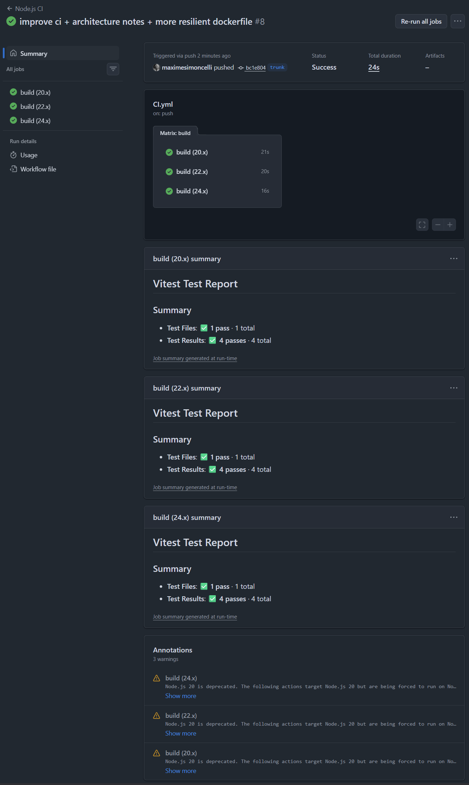
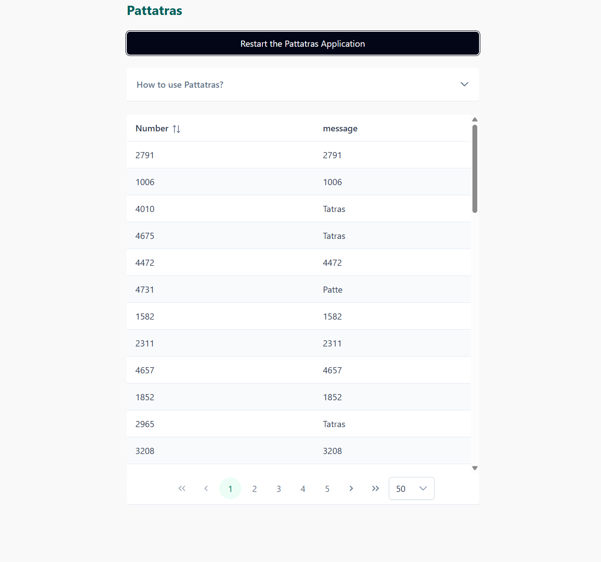

# Architecture

This project uses a standard vue.js 3 stack with typescript, separated in an app `ui` folder, where the interface is located, and a `libs` folder, containing the business logic and its tests.

It uses a very light, stripped-down DDD approach, with the business logic separated in its own context.

In terms of DX, I kept things light with a container to deploy the app in production and biome for linting and formatting. Biome works perfectly out of the box and provides a good set of defaults that helps bootstrap a small repository nicely without the hassle of the entire eslint ecosystem. A CI runs on Github Action to test the program against several versions of Node and also runs the testing suite.

The UI is stripped down to its bare essentials while still being pleasant to use thanks to the PrimeVue components library, which provides an excellent set of base component with strong accessibility support out of the box, as well as a good UX, an excellent candidate for something usable within the time constraint. My goal here was also making the application as simple as possible for most users, which is why it has a prominent help section, as well as a quick way to navigate through all numbers with the least amount of friction.

# Improvements that could be made.

In terms of UI, we could imagine a feature where the operator needs to check that a specific number yielded the right message, which could be done with a search input. We could also imagine the possibility to export the dataset to .csv file, which would be easily done by preparing a new presenter in pattatras.ts.

In terms of DX, husky + lint-staged would be excellent to be able to filter the linting and the testing to only modified files. UI Component and Feature testing would also be of importance to reinforce the application's resilience to new features and maintenance.

