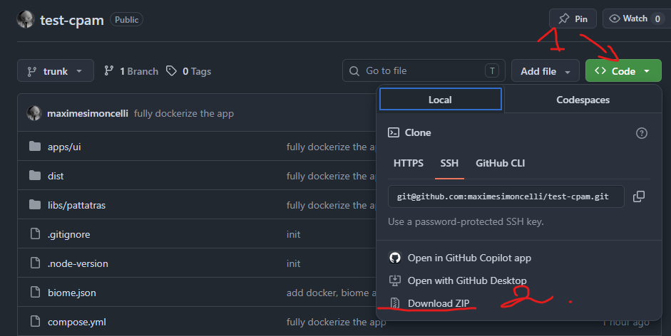
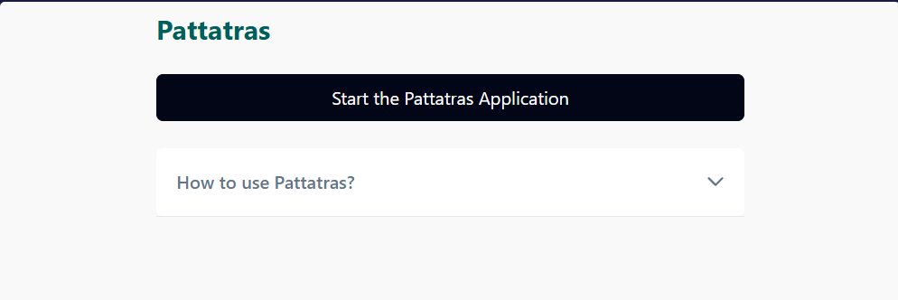
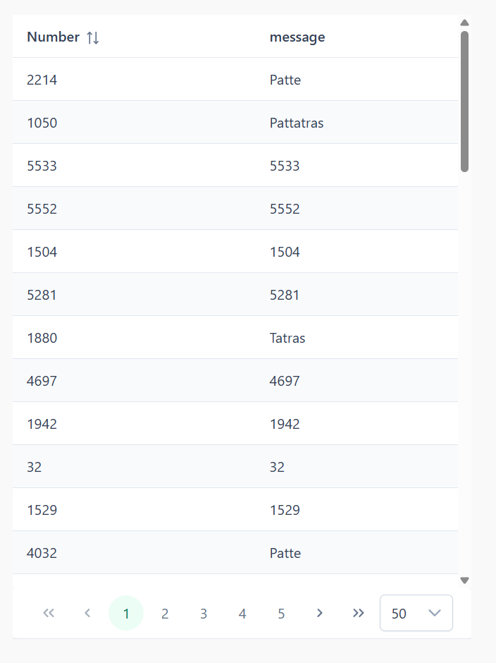

# Pattatras

[](https://github.com/maximesimoncelli/test-cpam/actions/workflows/CI.yml)

The main features of this program are as follows:

> Given a range of randomly arranged numbers between 1 and 6457 included
> When we iterate over this range of numbers, for each number multiple of 3
> Then we print "Patte" to the console

> Given a range of randomly arranged numbers between 1 and 6457 included
> When we iterate over this range of numbers, for each number multiple of 5
> Then we print "Tatras" to the console

> Given a range of randomly arranged numbers between 1 and 6457 included
> When we iterate over this range of numbers, for each number both a multiple of 5 and 3
> Then we print "Pattatras" to the console

> Given a range of randomly arranged numbers between 1 and 6457 included
> When we iterate over this range of numbers, for each number than is neither a multiple of 3 or 5
> Then we print the number to the console

## Installation

### If you only want the application

#### Pre-requisites

- Docker and Docker compose. If you are unsure, the Docker Desktop application will be enough: https://www.docker.com/products/docker-desktop/
- Git: https://git-scm.com/install/windows. Depending on your system (Windows, Linux, MacOs), make sure you download the right version for your system

#### Steps

- Download the github project using your terminal:

```
git clone https://github.com/maximesimoncelli/test-cpam.git
```

> Alternatively, you can simply download the repository [here](https://github.com/maximesimoncelli/test-cpam) and extract it in the folder of your choice.
> 

- Start the [container](https://www.docker.com/resources/what-container/) by opening a terminal in the folder named `test-cpam` you either downloaded or cloned via terminal and using the command `docker compose up -d`.

- The application is now running in the background.

See the [usage](#usage) section for the next steps to use the application.

### If you want to work on the project

#### Pre-requisites

- [Node v24.18 minimum](https://nodejs.org/fr/download). Other versions are untested.
- [Git](https://git-scm.com/install/windows). Make sure you download the right version for your system (windows, linux, mac os,)

#### Steps

- Download the github project using your terminal:

```
git clone https://github.com/maximesimoncelli/test-cpam.git
```

> Alternatively, you can simply download the repository [here](https://github.com/maximesimoncelli/test-cpam) and extract it in the folder of your choice.
> 

- Install the dependencies

```bash
npm install
```

- Refer to `package.json` to see the various scripts available. Here is a quick reference of the most useful commands:

| Command                  | Description                                      |
| ------------------------ | ------------------------------------------------ |
| `npm run ui:dev`         | launches the dev server on http://localhost:5173 |
| `npm run app:build`      | builds the application                           |
| `npm run ui:preview`     | launches the build at http://localhost:4173      |
| `npm run pattatras:test` | launches the test suite                          |

## Usage

When you have successfully launched the application, head to http://localhost:4173. You will be presented with the following interface:



> A set of helpful instructions is also available on the interface, simply click on "How to use Pattatras?".

- Click on "Start the Pattatras Application". A table with the result of the application will be shown.
  

- You can now navigate through all numbers using the pagination at the footer of the table. You can also sort the "Number" column by clicking on it. If you want, you can start the program again by clicking on the main button, which will now show "Restart the Pattatras Application".

## Licence

This program is shared using the MIT licence.
